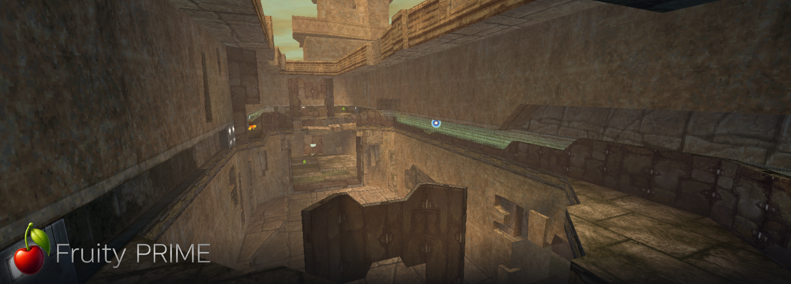

**Metroid Prime Hunters, playable again.** A fork of
[NoneGiven/MphRead](https://github.com/NoneGiven/MphRead) with online multiplayer, dedicated
servers, 8 players, high resolution, ultrawide, a real launcher, and an Android build.

> Needs your own Metroid Prime Hunters cartridge dump. No Nintendo game data ships here or is downloaded.

**[Download](https://github.com/liveteklol/Fruity-Prime/releases)** · [Server how-to](#dedicated-server) · [Support the project ☕](https://ko-fi.com/livetek)

## Features

- **Widescreen**: 16:9 and 21:9 ultrawide, a wider view rather than a stretched one
- **High resolution**: any window size, borderless fullscreen, 25-100% render scale
- **60 FPS**: fixed 60 Hz everywhere, with an FPS counter
- **8 players**: eight in a match, where the DS allowed four
- **Online**: server browser, join by address, host with zero router setup
- **Dedicated servers**: no game files needed, map rotation, runs on a Raspberry Pi
- **Demo recording**: record mid-match, replay it later, spectate live matches Quake-3 style
- **Custom maps**: convert a Quake 3 `.pk3` in one command, or build one from JSON. Dust II ships with the release
- **Bots**: 0 to 7 offline, three skill levels, and they navigate custom maps
- **All 12 modes**: Battle, Survival, Capture, Bounty, Defender, Nodes, Prime Hunter, and teams
- **Keyboard & mouse**: fully rebindable, aim sensitivity, inverted axes
- **Cel shading**: flat colours and inked edges, plus fog, lighting and filtering toggles
- **Modern HUD**: resizable weapon list, custom crosshair, helmet/visor/HUD opacity, no-helmet mode
- **A real launcher**: Host, Join, Watch a demo, Settings, on Windows, Linux, macOS and Android
- **Map previews**: rendered on your own machine, nothing downloaded
- **Story mode**: 3 save slots, straight from the launcher, upstream bug fixes on by default
- **Android**: real APK, GL ES 3.0 renderer, touch controls, online play
- **Update check**: tells you when a newer release is out; installs nothing

Plus everything upstream already did: model viewer, scene renderer, collision view, COLLADA/PNG/WAV
export, Blender scripts.

## Getting started

1. [Download](https://github.com/liveteklol/Fruity-Prime/releases) your platform's package.
2. Run it — `FruityPrime.exe` on Windows, `FruityPrime -launcher` on Linux. macOS: `xattr -dr com.apple.quarantine .` first.
3. **Game files** → pick your `.nds`. It unpacks locally, with a progress bar.
4. Play. `Escape` = pause menu, `F11` / `Alt+Enter` = fullscreen.

Hosting a game: **Host → Battle → Where: Online**. The directory runs the match and you join it. No
port forwarding, nothing to configure.

## Dedicated server

No game files needed. Runs on a Raspberry Pi.

```bash
# Linux
./FruityPrime -server -port 27888 -players 8 -servername "My server"
# Windows (console binary, not FruityPrime.exe)
FruityPrimeServer.exe -server -port 27888 -players 8 -servername "My server"
```

| Flag | |
|---|---|
| `-port N` | UDP port. Default 27888 |
| `-players N` | slots. Default 4, use 8 |
| `-servername "NAME"` | shown in the browser |
| `-rotation FILE` | default `maprotation.txt`, written beside the binary on first run |
| `-friendlyfire` | team damage on |
| `-nomaster` | stay off every server list |
| `-master HOST` `-masterport N` | use another directory than `net.livetek.fr:27889` |

**Map rotation**: `maprotation.txt`, one match per line, `#` for comments:

```
MP1 SANCTORUS      | Battle | 7 | 7
MP3 PROVING GROUND | Battle | 7 | 7
```

`ROOM KEY | mode | minutes | points`. Only the key is required. `FruityPrime -rooms` lists every
key, the 27 cartridge rooms and any custom map (needs game files, so run it on a machine that has
them).

**Ports**: UDP only. Forward **27888** to the server. The directory uses **27889**.

**Listed by default** on `net.livetek.fr`. Check with `FruityPrime -servers`.

**systemd**: units in `tools/systemd/`:

```bash
sed -e 's|__USER__|youruser|' -e 's|__DIR__|/home/youruser/fruityprime-server|' \
    tools/systemd/mphread-server.service | sudo tee /etc/systemd/system/mphread-server.service
sudo systemctl enable --now mphread-server
```

`deploy-server.sh` does build + upload + units + restart against a remote box. Stop the service
before replacing the binary; systemd holds it open.

**Your own directory**: `FruityPrime -masterserver -port 27889`, plus `-public HOST` if a game
server shares the box, `-hostports A-B` for the range it may run matches on. Point servers at it
with `-master HOST`, players in *Settings → Servers*.

**Versions must match.** `ProtocolVersion` is **4**; a server refuses a different build at Hello.
Update the server first.

## Command line

`-launcher [-text]` · `-connect HOST -port N -name X -hunter H` · `-servers` · `-hostgame "ROOM"` ·
`-server` · `-masterserver` · `-rooms` · `-q3convert FILE.pk3` · `-demoinfo FILE [-replay]` · `-mapgen` · `-mechanics` ·
`-update` / `-noupdate` · `-credits` · `-fullscreen` / `-windowed` / `-nohelmet` · `-cel on|off` ·
`-fog on|off` · `-menu`

Full list, test harness included: [`CLAUDE.md`](CLAUDE.md).

## Not done yet

- **Adventure co-op.** The launcher's toggle is a placeholder and blocks Start on purpose. The
  network layer replicates players only, so no enemies, doors, pickups or save state.
- **Gamepads**, on any platform.
- **Android**: no command line (so no exports, no model viewer, no CLI server), no window settings,
  demo *playback* not wired (recording works), cel shading unverified on real hardware.
- What is claimed but not yet proven is listed in [`.claude/KNOWN-GAPS.md`](.claude/KNOWN-GAPS.md).

## Building

```bash
dotnet publish src/MphRead/MphRead.csproj -c Release \
  -r win-x64|linux-x64|osx-x64|osx-arm64 --self-contained true -p:PublishSingleFile=true
```

`-p:MphReadServer=true` for a server build. Android: `dotnet build src/MphRead.Android/MphRead.Android.csproj`
with the `android` workload. Minimum SDK [.NET 9.0](https://dotnet.microsoft.com/en-us/download/dotnet/9.0).

## Support

If this is useful to you: **[ko-fi.com/livetek](https://ko-fi.com/livetek)** ☕

---

*Below is upstream MphRead's own README, unchanged.*

# Upstream: MphRead

This project is a reverse engineering and game recreation effort comprising a model viewer, scene renderer, and general parser for file formats used in the Nintendo DS game Metroid Prime Hunters. The renderer is implemented using OpenGL via the [OpenTK](https://github.com/opentk/opentk) library with audio through [OpenAL Soft](https://github.com/kcat/openal-soft) and [SoundFlow](https://github.com/LSXPrime/SoundFlow). Documentation of various game features can be found in the [wiki](https://github.com/NoneGiven/MphRead/wiki).

## Features
- Recreates the gameplay of the original game
- Stores save data to allow playing through the story mode
- Renders individual models or complete game rooms with entities
- Visualizes collision data for rooms and entities
- Exports models to COLLADA, textures to PNG, and sound effects to WAV
- Generates Python scripts to import model animations and more into Blender

## Planned
- Room editor and save editor
- Render more things, implement more gameplay logic
- And even more!

## Usage

After setup, MphRead can be launched from the executable with no arguments, and menu prompts will appear to help you set up the scene.

See the [full setup and export guide](https://github.com/NoneGiven/MphRead/wiki/Setup-&-Export-Guide) for details on setup and command line options.

## Building

If you do not want to build from source, simply download and run the latest [release](https://github.com/NoneGiven/MphRead/releases).

### With Visual Studio

With a recent version of [Visual Studio 2022 or 2026](https://visualstudio.microsoft.com/vs/) installed, you should be able to open the solution and build immediately.

### Without Visual Studio

- Install the .NET SDK. The [latest stable version](https://dotnet.microsoft.com/en-us/download/dotnet/latest) is recommended, while the minimum required version is [.NET 9.0](https://dotnet.microsoft.com/en-us/download/dotnet/9.0).
- Run `dotnet build` in the `src/MphRead` directory.

## Acknowledgements

A significant portion of this project's code was based on the file format information or source code from several other projects.

- **dsgraph** - The original MPH model viewer, on which all other projects are built.
- **[Chemical's model format](https://gitlab.com/ch-mcl/metroid-prime-hunters-file-document/-/blob/master/Model/BinModel.md)** - Documentation of the model format.
- **[McKay42's mph-model-viewer](https://github.com/McKay42/mph-model-viewer)** - COLLADA export method.
- **[McKay42's mph-arc-extractor](https://github.com/McKay42/mph-arc-extractor)** - ARC file format information.
- **[Barubary's dsdecmp](https://github.com/Barubary/dsdecmp)** - LZ10 compression routines.
- **[loveemu's swav2wav](https://github.com/loveemu/loveemu-lab)** - SWAV conversion function.
- **[Gericom's ffmpeg patch](https://lists.ffmpeg.org/pipermail/ffmpeg-devel/2021-March/277774.html)** - ActImagine VX movie file format information.
- **[CharlesVanEeckhout's actimagine decoder](https://github.com/CharlesVanEeckhout/actimagine)** - Further understanding of VX video decoding, based on the above ffmpeg patch.
- **[CyberBotX's NCSF](https://github.com/CyberBotX/NCSF)** - Source code for the NCSF converter and player for Nintendo DS sequenced music.

## Special Thanks

This project's reverse engineering effort was developed parallel to **[hackyourlife's mph-viewer](https://github.com/hackyourlife/mph-viewer)**, a model viewer implementation in C. Major features such as the transparency rendering implementation were derived from its source code.
